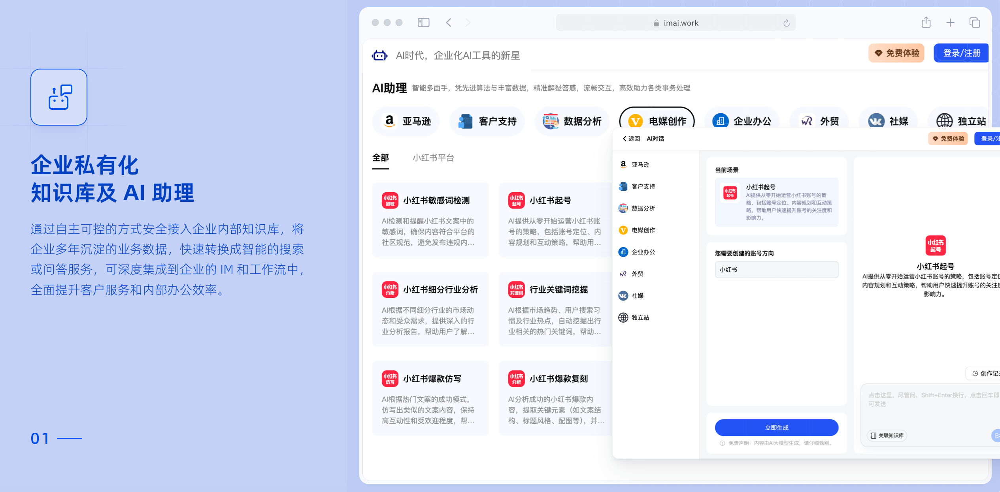
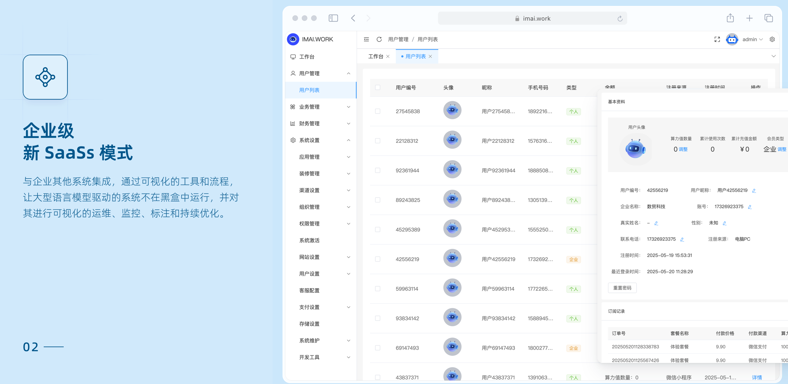
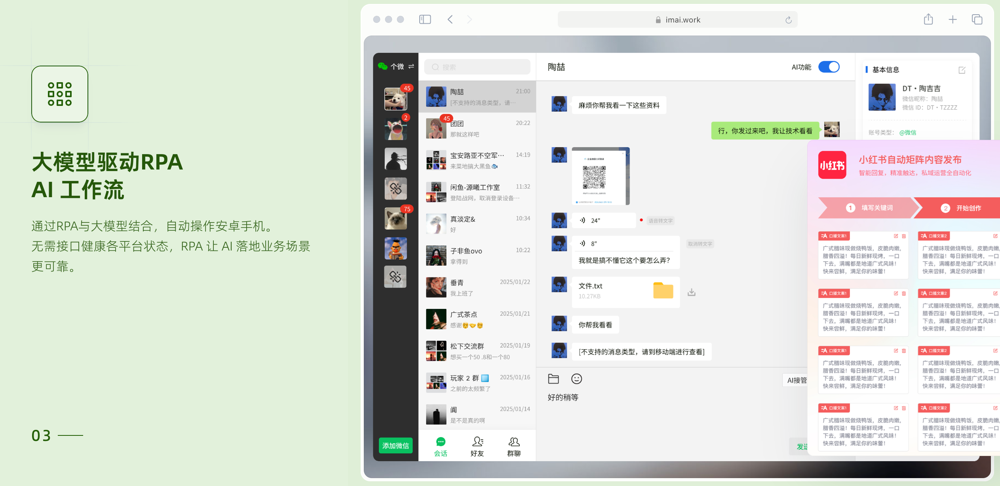
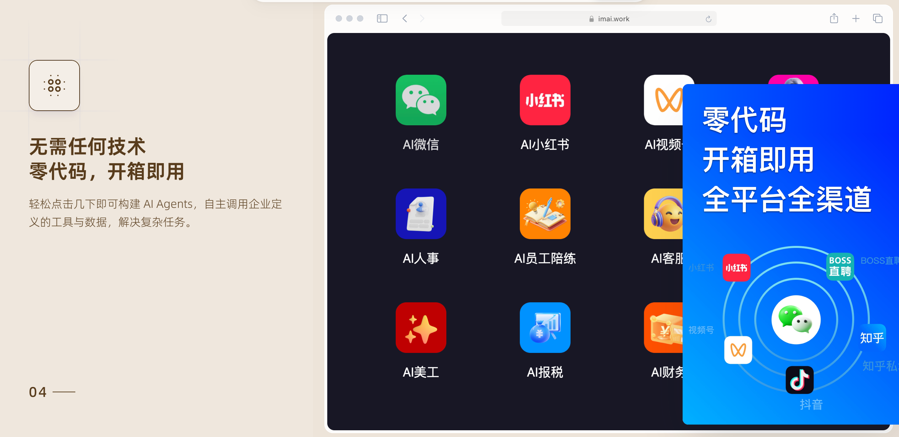

# 🤖 IMAI.WORK —— 开源的 AI 数字员工系统

  
  
  

  <a href="#文档">文档</a> |
  <a href="#安装教程">安装</a> |
  <a href="#部分图片演示">截图</a> |
  <a href="#核心技术">架构</a> |
  <a href="#数据库字典">数据库字典</a> |
  <a href="#api文档">API 文档</a> |
  <a href="#快速开始">快速开始</a>

 

---

## 📌 项目简介

**IMAI.WORK**（又称 AI 员工、数字化工作者或非人类员工）是一种由软件驱动的实体，具备多领域技能组合，能够自主执行端到端的 AI 工作流。其任务职责根据岗位属性、行业特性及管理层设定的战略目标动态调整，并拆分为具体的工作流程。

与普通大模型、Coze 和 Manus 相比，IMAI.WORK 拥有以下四大核心特征：

1. **🌍 物理世界存在**：能在现实场景中工作（自动运转的手机或电脑）
2. **🌐 全渠道能力**：可跨多个线上线下渠道无缝服务（微信、抖音、快手、小红书、电话、App 私信等）
3. **🔄 全流程能力**：打通工作流，实现自动化闭环（如内容制作、自动发布、客户自动回复与打标签）
4. **🏢 全场景能力**：适用于企业各个岗位，覆盖内外部协作需求  
   - 对内：会议纪要、AI 面试、员工陪练  
   - 对外：AI 客服、全流程获客

---

### 🚗 IMAI.WORK vs. Agent 智能体

> 类比说明：

- **Agent 智能体**：如同“定速巡航”的汽车，仍需人类操控  
- **AI 数字员工**：如同“完全自动驾驶”汽车，无需干预，独立运作

---

## ❓ 为什么需要数字员工？

- 80% CEO 担心市场推广及客户线索不足  
- 59% CFO 认为降本是当前的企业关键目标  
- 人类员工常见问题：成本高、效率低、情绪化、易出错、管理难、学习慢、偏见重

### ✅ 数字员工的价值与愿景

- 解放人类从重复性劳动中脱身，专注高价值工作
- 激发员工创造力，实现个人成长与企业协同共赢

---

## 🛠️ 应用场景

这不是普通 AI！它们可以真实顶替岗位，干“人类的活”：

- 自动处理客户售后问题  
- 自动生成短视频/图文并发布  
- 自动写文案并投放发布  
- 跟踪客户生命周期推送销售引导  
- 从公域流量引流至私域成交  
- 自动在招聘软件（如 BOSS 直聘）执行任务  
- 自动记录会议纪要并自我学习  
- 员工话术对练、产品理解训练  
- 与用户对话生成思维导图并自我吸收

### 🚧 开发中案例

- **电销型数字员工**：电话与客户沟通、加微信、实时解决问题  
- **财务型数字员工**：自动核对发票、执行付款流程并入账  
- **法务顾问数字员工**：在线解答法律问题与合同审查  
- **报税顾问数字员工**：自动完成报税任务（RPA 驱动）

---

## 🔑 核心功能

### 所有功能后续免费更新

| 模块 | 功能 | 详情 | 状态 |
|------|------|------|------|
| **AI会议纪要** | 实时记录 | 支持对会议进行在线记录 | 已上线 |
|  | 音视频文件记录 | 能够将实时音频流或音视频文件中的语音转写成文字 | 已上线 |
|  | ASR | 能够将对话中的人进行区分 | 已上线 |
|  | 翻译 | 支持将音视频文件语音的中、英、日、韩语间的双向互译 | 已上线 |
|  | **大模型能力** | 全文摘要：对完整的音视频内容进行总结 | 已上线 |
|  |  | 发言总结：对不同发言人的说话内容进行总结 | 已上线 |
|  |  | 问答回顾：提问分析与回答内容提炼 | 已上线 |
|  |  | 思维导图：生成绘图所需结构数据 | 已上线 |
|  |  | 关键词：提取关键词 | 已上线 |
|  |  | 待办事项：提取待办事项 | 已上线 |
| **AI数字人** | 形象克隆 | 对上传人物视频进行复制 | 已上线 |
|  | 音色克隆 | 克隆音频声音，生成一致音色语音 | 已上线 |
|  | 音频合成 | 克隆音色 + 文案内容生成新音频 | 已上线 |
|  | 视频合成 | 生成口型与音频匹配的视频 | 已上线 |
|  | AI生成文案 | 自动生成文案内容 | 已上线 |
| **AI图片设计** | 文生图 | 文本生成图像 | 已上线 |
|  | 图生图 | 图像生成相似风格图 | 已上线 |
|  | 商品海报图 | 电商商品背景图生成 | 已上线 |
|  | 模特换衣 | 上传平铺图+人像生成试衣图 | 已上线 |
| **DEEPSEEK聊天** | 推理模式 | AI逻辑分析+推理 | 已上线 |
|  | 对话模式 | 自然语言交互 | 已上线 |
| **AI陪练** | 场景对练 | 模拟真实场景互动 | 已上线 |
|  | 练习报告 | 分析痛点并建议话术 | 已上线 |
|  | 自定义场景 | 用户设定个性化场景参数 | 已上线 |
| **AI人事** | 岗位管理 | 自动生成JD与AI面试官 | 已上线 |
|  | RPA自动招聘 | 流程自动化筛选邀约 | 已上线 |
|  | AI面试 | 模拟真人面试官 | 已上线 |
|  | 面试报告 | 可视化面试评估 | 已上线 |
|  | 面试记录 | 存档文字/音频记录 | 已上线 |
|  | 数据导出 | 导出面试数据 | 已上线 |
| **AI思维导图** | 自动生成 | 根据主题生成结构化导图 | 已上线 |
| **AI个微** | 好友智能聊天 | AI自动跟好友聊天 | 已上线 |
|  | 多微信号管理 | 一站式多账号同步操作 | 已上线 |
|  | 关键词回复 | 自动触发多形式回复 | 已上线 |
|  | 新客欢迎语 | 自动发送开场白 | 已上线 |
| **知识库** | 知识库管理 | 上传/分类/管理知识 | 已上线 |
|  | 知识训练 | 提升 AI 精准回答能力 | 已上线 |
|  | 智能切片 | 内容拆解与任务分解 | 已上线 |
|  | 会议纪要分析训练 | 优化目标回复能力 | 已上线 |
|  | 陪练记录训练 | 改进学习表现反馈 | 已上线 |
|  | 通用聊天训练 | 提升通用聊天与助理能力 | 已上线 |
|  | 个微接入知识库 | 支持 FAQ/产品信息等 | 已上线 |
|  | 助理接入知识库 | 提供精准信息服务 | 已上线 |
|  | AI陪练接入知识库 | 提升陪练训练效果 | 已上线 |
| **小红书AI自动引流** | 智能私信 | 自动回复私信 | 已上线 |
|  | 智能评论 | 自动回复评论 | 已上线 |
|  | 自动发布内容 | 按设定日期发送内容 | 已上线 |
|  | AI生成内容 | 自动生成营销图文视频 | 已上线 |

---

## 🧠 核心技术栈

| 模块       | 技术框架                                     |
|------------|----------------------------------------------|
| 前端       | Vue、Vuex、Vant、Ant Design of Vue           |
| 后端       | PHP、MySQL、Redis、Swoole、Hyperf            |
| RPA 端     | auto.js                                      |

---

<h3>🛠 环境部署</h3>

---

<h3>📦 安装教程</h3>

---

## 📸 部分图片演示

